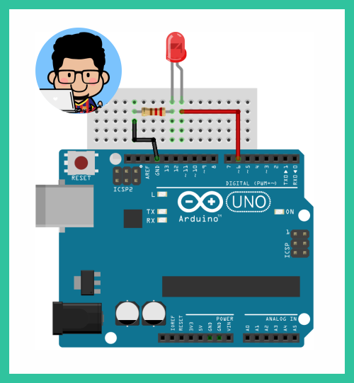
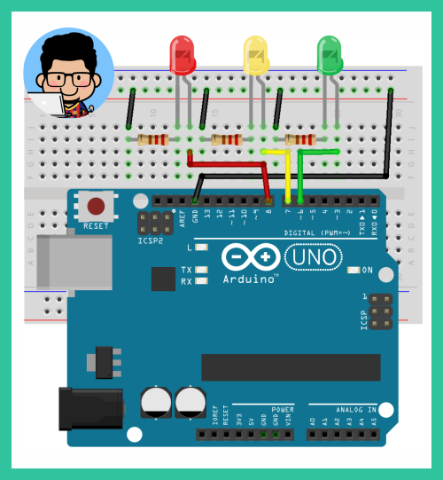

# **Workshop Introduction to Arduino**


# *__3. Arduino & LEDs__*

## **3a. Blinking an LED :heavy_check_mark:**

  1. **Schematics :wrench: :hammer:**
      
      Assemble your parts as the schematics below.
      
      

  2. **Sketch :clipboard:**
      
      Open Arduino IDE, type & upload the sketch below.

        ```c++
        void setup() {
          Serial.begin(9600);
          pinMode(6, OUTPUT);
        }

        void loop() {
          Serial.println("status LED: hidup");
          digitalWrite(6, HIGH);
          delay(1000);
          Serial.println("status LED: mati");
          digitalWrite(6, LOW);
          delay(1000);
        }
        ```

  - __Done!__ :ballot_box_with_check:

#

## **3b. Create a mini traffic light :heavy_check_mark:**

  1. **Schematics :wrench: :hammer:**
      
      Assemble your parts as the schematics below.
      
      

  2. **Sketch :clipboard:**
      
      Open Arduino IDE, type & upload the sketch below.

        ```c++
        void setup() {
          Serial.begin(9600);
          pinMode(6, OUTPUT);
          pinMode(7, OUTPUT);
          pinMode(8, OUTPUT);
        }

        void loop() {
          digitalWrite(6, HIGH);
          digitalWrite(7, LOW);
          digitalWrite(8, LOW);
          delay(5000);
          digitalWrite(6, LOW);
          digitalWrite(7, HIGH);
          digitalWrite(8, LOW);
          delay(1000);
          digitalWrite(6, LOW);
          digitalWrite(7, LOW);
          digitalWrite(8, HIGH);
          delay(5000);
          digitalWrite(6, LOW);
          digitalWrite(7, HIGH);
          digitalWrite(8, LOW);
          delay(1000);
        }
        ```

  - __Done!__ :ballot_box_with_check:

  - __Next material: :fast_forward: *[Arduino & DHT11](https://github.com/LintangWisesa/Purwadhika-Workshop-Arduino/tree/master/4_Arduino_DHT11)*__ 

#

## **Table of Contents :memo:**

  No.|Material|Tutorial
  -----|-----|-----
  0.|Setup _**(please do this before the workshop)**_ :point_right:|_**[click here](https://github.com/LintangWisesa/Purwadhika-Workshop-Arduino/tree/master/0_Setup)**_
  1.|Hello World!|_**[click here](https://github.com/LintangWisesa/Purwadhika-Workshop-Arduino/tree/master/1_Hello_World)**_
  2.|Arduino's Built-in LED|_**[click here](https://github.com/LintangWisesa/Purwadhika-Workshop-Arduino/tree/master/2_Arduino_BuiltInLED)**_
  3.|Arduino & LEDs|_**[click here](https://github.com/LintangWisesa/Purwadhika-Workshop-Arduino/tree/master/3_Arduino_LEDs)**_
  4.|Arduino & DHT11|_**[click here](https://github.com/LintangWisesa/Purwadhika-Workshop-Arduino/tree/master/4_Arduino_DHT11)**_

#

#### Lintang Wisesa :love_letter: _lintangwisesa@ymail.com_

[Facebook](https://www.facebook.com/lintangbagus) | 
[Twitter](https://twitter.com/Lintang_Wisesa) |
[Google+](https://plus.google.com/u/0/+LintangWisesa1) |
[Youtube](https://www.youtube.com/user/lintangbagus) | 
:octocat: [GitHub](https://github.com/LintangWisesa) |
[Hackster](https://www.hackster.io/lintangwisesa)
