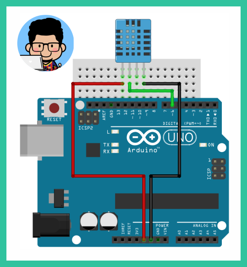

# **Workshop Introduction to Arduino**


# *__4. Arduino & DHT11__*

  1. **Schematics :wrench: :hammer:**
      
      DHT11 is a non-industrial grade temperature & humidity sensor that can use with Arduino board. Assemble your Arduino & a DHT11 module as the schematics below.
      
      

  2. **Sketch :clipboard:**
      
      Open Arduino IDE, go to __Sketch > Include Library > Manage Libraries__ then search & download __DHT11 sensor library__ by __Adafruit__. After installation finish, type & upload the sketch below.

      ```c++
      #include "DHT.h" 
      #define DHTPIN 6
      #define DHTTYPE DHT11
      DHT dht(DHTPIN,DHTTYPE);

      void setup(){
        Serial.begin(9600);
      }

      void loop(){
        int kelembaban = dht.readHumidity();
        int suhuCelcius = dht.readTemperature();
        int suhuFahrenheit = dht.readTemperature(true);

        Serial.print("Kelembaban: ");
        Serial.print(kelembaban);
        Serial.print(" %\t");
        Serial.print("Suhu: ");
        Serial.print(suhuCelcius);
        Serial.print(" *C ");
        Serial.print(suhuFahrenheit);
        Serial.println(" *F\t");
        delay(1000);
      }
      ```

  - __Done!__ :ballot_box_with_check:

#

## **Table of Contents :memo:**

  No.|Material|Tutorial
  -----|-----|-----
  0.|Setup _**(please do this before the workshop)**_ :point_right:|_**[click here](link)**_
  1.|Hello World!|_**[click here](link)**_
  2.|Arduino's Built-in LED|_**[click here](link)**_
  3.|Arduino & LEDs|_**[click here](link)**_
  4.|Arduino & DHT11|_**[click here](link)**_

#

#### Lintang Wisesa :love_letter: _lintangwisesa@ymail.com_

[Facebook](https://www.facebook.com/lintangbagus) | 
[Twitter](https://twitter.com/Lintang_Wisesa) |
[Google+](https://plus.google.com/u/0/+LintangWisesa1) |
[Youtube](https://www.youtube.com/user/lintangbagus) | 
:octocat: [GitHub](https://github.com/LintangWisesa) |
[Hackster](https://www.hackster.io/lintangwisesa)
