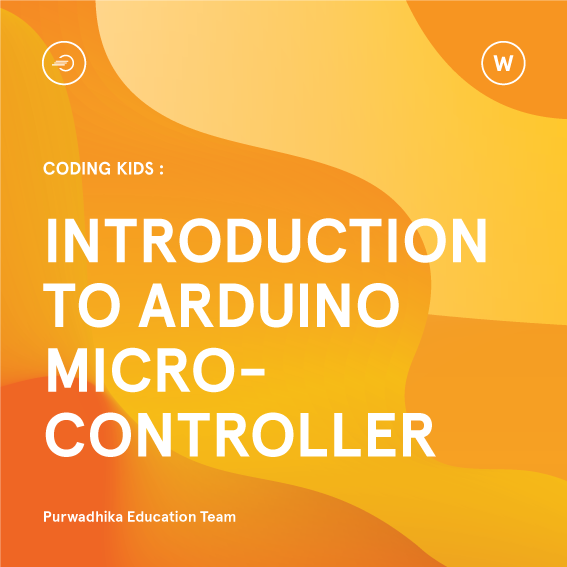

# **Workshop Introduction to Arduino**

## **About This Workshop :mega:**

  __*Arduino*__ is an open-source hardware and software company, project and user community that designs and manufactures single-board microcontrollers and microcontroller kits for building digital devices. Arduino boards are equipped with sets of digital and analog input/output (I/O) pins that may be interfaced to various expansion boards or breadboards (shields) and other circuits. More info about Arduino: [click here](https://www.arduino.cc/).
  
  In this __2 hours__ workshop, we’ll stick to the basics Arduino project. We will see how to configure the Arduino IDE, Arduino Uno board, and finally how to control an actuator (LED) & monitor a sensor (DHT11). We’ll simply be using the Arduino Uno R3, some LEDs, a DHT11 sensor & Arduino IDE to program it.

#

## **What Should You Bring :mega:**

  - :computer: A laptop _**(Windows/MacOS/Linux)**_.

#

## **What Will You Get :gift:**

  - :wrench: Arduino mini starter kit.
  - :hamburger: Snack & lunch.
  - :mortar_board: Digital certificate.

#

## **What Will You Learn :memo:**

  No.|Material|Tutorial
  -----|-----|-----
  0.|Setup _**(please do this before the workshop)**_ :point_right:|_**[click here](https://github.com/LintangWisesa/Purwadhika-Workshop-Arduino/tree/master/0_Setup)**_
  1.|Hello World!|_**[click here](https://github.com/LintangWisesa/Purwadhika-Workshop-Arduino/tree/master/1_Hello_World)**_
  2.|Arduino's Built-in LED|_**[click here](https://github.com/LintangWisesa/Purwadhika-Workshop-Arduino/tree/master/2_Arduino_BuiltInLED)**_
  3.|Arduino & LEDs|_**[click here](https://github.com/LintangWisesa/Purwadhika-Workshop-Arduino/tree/master/3_Arduino_LEDs)**_
  4.|Arduino & DHT11|_**[click here](https://github.com/LintangWisesa/Purwadhika-Workshop-Arduino/tree/master/4_Arduino_DHT11)**_
  
  :exclamation: _**Note.**_ Please read & do the _**first material**_ before the workshop is being held.

#

#### Lintang Wisesa :love_letter: _lintangwisesa@ymail.com_

[Facebook](https://www.facebook.com/lintangbagus) | 
[Twitter](https://twitter.com/Lintang_Wisesa) |
[Google+](https://plus.google.com/u/0/+LintangWisesa1) |
[Youtube](https://www.youtube.com/user/lintangbagus) | 
:octocat: [GitHub](https://github.com/LintangWisesa) |
[Hackster](https://www.hackster.io/lintangwisesa)
